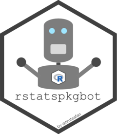

<!-- README.md is generated from README.Rmd. Please edit that file -->

# rstatspkgbot

<!-- badges: start -->

<!-- badges: end -->

## Hi I’m rstatspkgbot …

… an automated Twitter bot made by [Tim
Tiefenbach](https://twitter.com/TimTeaFan). I tweet about random
\#RStats packages on CRAN 2-4 times a day.

If you want to see my tweets in your feed, follow me on Twitter.

If you are interested in my setup, have a look at the remainder of this
README and browse my code.

The most essential parts are:

-   the [R script](/R/create_post_and_tweet.R) that creates and posts
    the tweets
-   the [YAML script](/.github/workflows/tweet_rpkg.yaml) that automates
    my workflow using Github Actions

## Idea & History

For some time I wanted to get acquainted with the Twitter API and the
{rtweet} package. I came up with several projects and this Twitter bot
was one of them. The idea was to create a simple but still helpful
Twitter bot without spending too much effort on it. Since there are over
18,000 packages on CRAN, I thought it might be helpful to see some
Tweets in my timeline introducing random packages I might never have
heard of otherwise. Maybe similar Twitter bots exist already, but the
whole project was about making one myself.

## Setup

The setup is rather simple, mainly because {rvest} and {rtweet} make it
really easy to scrap websites and interact with the Twitter API. The
basic workflow is:

1.  read-in the actual list of packages on CRAN
2.  match it (anti-join) with a list of packages already tweeted about
3.  draw a random package out of the remaining ones
4.  create and post a tweet linking the CRAN package website
5.  add the newly tweeted package to the list of already tweeted
    packages

This workflow is automated via GitHub Actions. The whole project is set
up as an R package that contains a description file with all
dependencies.

## Acknowledgements

When creating this Twitter bot I closely read and followed [this blog
post](https://oscarbaruffa.com/twitterbot/) by [Oscar
Baruffa](https://twitter.com/oscarbaruffa/) and [this blog
post](https://www.rostrum.blog/2020/09/21/londonmapbot/) by [Matt
Dray](https://twitter.com/mattdray/). Thank you both for your write-up,
this made things much easier compared to figuring stuff out myself.

Credit goes to the creators and maintainers of the amazing {rvest} and
{rtweet} packages! Together they make it ridiculously easy to scrap
website contents and interact with the Twitter API.

Finally, credit goes to GitHub for providing a service like GitHub
Actions for free. I still can’t believe that this doesn’t cost a single
cent.

## Disclaimer

This is just a side project which I built in my free time. It comes with
no guarantees whatsover. If you find a bug, just file an issue (as with
any other repo).
